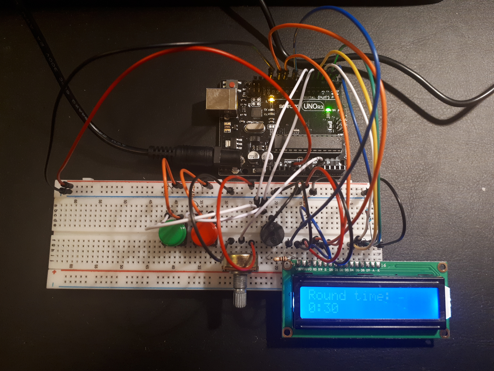

# ART (Arduino Round Timer)
ART is a personal project to create a simple yet versatile round timer for interval activities like boxing, muay thai, tabata, HIIT, etc.

## Usage
### Setup
Use the green pushbutton to confirm the current option and move to the next screen. Use the red pushbutton to cancel and go back to the previous screen. Turn the potentiometer to select different options. After confirming the round duration, the rest duration, and the number of rounds, the device will give a couple seconds to prepare before starting the first round.

### Active round/rest period
Use the red pushbutton to pause the timer. Use the red pushbutton again to return to setup, or use the green pushbutton to resume the timer.

#### Round durations:
- 30 seconds
- 60 seconds
- 1 minute 30 seconds
- 2 minutes
- 2 minutes 30 seconds
- 3 minutes
- 5 minutes

#### Rest durations:
- 15 seconds
- 30 seconds
- 45 seconds
- 1 minutes
- 1 minute 15 seconds
- 1 minute 30 seconds
- 2 minutes

#### Number of rounds:
- 1 round
- 3 rounds
- 4 rounds
- 6 rounds
- 9 rounds
- 12 rounds
- 99 rounds

The buzzer will produce a long single beep to signal the beginning of a round, and three short beeps to signal the end of a round.

## Components
- 1x Arduino Uno
- 1x USB cable
- 1x 10k ohm potentiometer
- 1x Passive (piezo) buzzer 
- 2x Pushbuttons
- 2x Pushbutton caps (green and red)
- 1x 100 ohm resistor
- 1x 220 ohm resistor
- 2x 1k ohm resistors
- 1x 3k ohm resistor
- 1x 9V 1A power supply

Optionally, you can replace the power supply with a portable power source like a 9V battery.

## Wiring diagram
Coming soon!

## Vs. Current products on the market
### [Rival Gym Timer](https://www.rivalboxing.ca/products/rival-gym-timer-1)
- Much more expensive: $140 CAD
- Less round duration options: only 1, 2, and 3 minutes
- Less rest duration options: only 30 and 60 seconds
- No pre-determined number of rounds

## Future improvements/additions?
- Louder buzzer/speakers? (HIGHLY RECOMMENDED)
- LED integration?
- Remote control?
- Voice control?
- Taking over the UFC Performance Institute?

## License
MIT © Elijah Hewer
